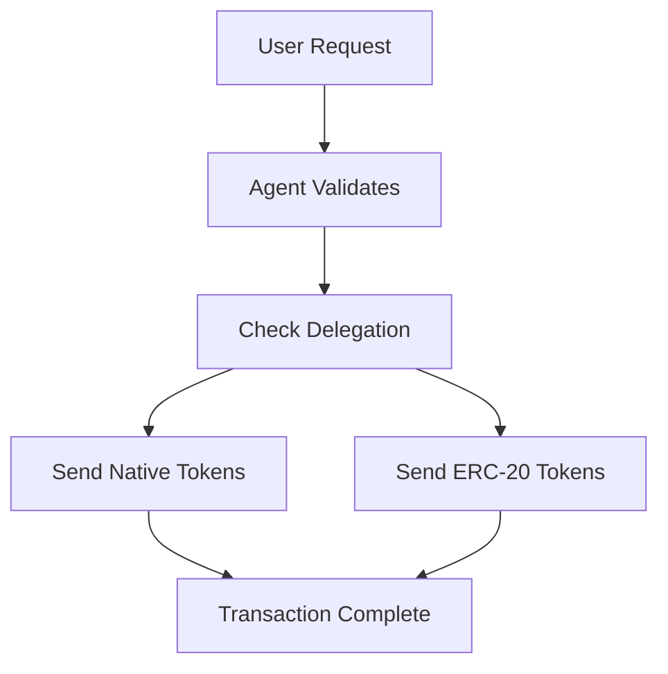

## Overview

This tutorial shows you how to build a faucet agent using the [Brewit Agent Template](https://github.com/brewitmoney/agent-template). The agent uses Brewit's delegation system to distribute tokens from delegated accounts, providing a secure and efficient way to run a token faucet service.

## What You'll Learn

- How to set up and run the faucet agent
- How Brewit delegation works for token distribution
- How to customize the agent for your needs
- How to interact with the agent's API from any client

## Setting up the agent

<Steps>
  <Step title="Clone the Agent Template">
    <p>
      Start by cloning the Brewit Agent Template repository to your local machine.
    </p>
    <CodeGroup>
      ```bash
      git clone https://github.com/brewitmoney/agent-template.git
      cd agent-template
      ```
    </CodeGroup>
  </Step>

  <Step title="Install Dependencies">
    <p>
      Install all required dependencies using your preferred package manager.
    </p>
    <CodeGroup>
      ```bash npm
      npm install
      ```
      ```bash pnpm
      pnpm install
      ```
      ```bash yarn
      yarn install
      ```
      ```bash bun
      bun install
      ```
    </CodeGroup>
  </Step>

  <Step title="Configure Environment">
    <p>
      Set up your environment variables by copying the example file and adding your configuration.
    </p>
    <CodeGroup>
      ```bash
      cp env.example .env
      ```
    </CodeGroup>
    <p>
      Edit the <code>.env</code> file with your configuration:
    </p>
  </Step>

  <Step title="Configure Agent Settings">
    <p>
      Set up your agent configuration by editing the config file with your private key and salt.
    </p>
    <CodeGroup>
      ```json
      {
        "privateKey": "your_private_key_here" // Optional,
        "salt": "your_session_salt_here"
      }
      ```
    </CodeGroup>
  </Step>

  <Step title="Start the Agent">
    <p>
      Launch the development server to start your faucet agent.
    </p>
    <CodeGroup>
      ```bash
      yarn dev
      ```
    </CodeGroup>
    <p>
      The agent will start on <code>http://localhost:8002</code>
    </p>
  </Step>

</Steps>

## Using the Agent API

Once your agent is running and you have set up delegation, here's the complete flow to claim tokens:

<Steps>
  <Step title="Get Agent Information">
    <p>
      First, get the agent's validator information by querying the info endpoint.
    </p>
    <CodeGroup>
      ```bash
      curl http://localhost:8002/info
      ```
    </CodeGroup>
    <p>
      This returns the agent's validator details needed for delegation setup.
    </p>
  </Step>

  <Step title="Set Up Delegation">
    <p>
      Create a delegated account using the validator info from the previous step. Follow the <a href="/build/delegated-account">delegation guide</a> to set up the delegated account for the agent.
    </p>
    <p>
      The delegated account will have permission to spend tokens on behalf of the main account, enabling the faucet to distribute tokens securely.
    </p>
  </Step>

  <Step title="Claim Tokens">
    <p>
      Once delegation is set up, you can claim tokens from the faucet using the claim endpoint.
    </p>
    <CodeGroup>
      ```bash
      curl -X POST http://localhost:8002/claim \
        -H "Content-Type: application/json" \
        -d '{
          "tokens": ["0x1234..."],
          "toAddress": "0x5678..."
        }'
      ```
    </CodeGroup>
  </Step>
</Steps>

## How Delegation Works

The faucet agent uses Brewit's delegation system to distribute tokens securely:

### 1. Account Setup
- The agent creates a main account using the private key
- It gets delegated access to tokens from other accounts
- This allows the agent to spend tokens without needing the original account's keys

### 2. Token Distribution Flow


### 3. Security Benefits
- **No private key exposure**: The agent doesn't need the original account's private keys
- **Controlled access**: Delegation can be revoked at any time
- **Account abstraction**: Uses smart contract wallets for enhanced security


### Other Endpoints

### Health Check

```bash
curl http://localhost:8002/health
```

## Customizing the Agent

### 1. Modify Token Amounts

Edit `src/executer/index.ts` to change the token distribution amounts:

```ts
// Native token amount (ETH)
value: parseEther('0.1') // Change from 0.1 to your desired amount

// ERC-20 token amount
amount: '0.001' // Change from 0.001 to your desired amount
```

### 2. Add Rate Limiting

Add rate limiting to prevent abuse in `src/routes/faucet.ts`:

```ts
import rateLimit from 'express-rate-limit';

const limiter = rateLimit({
  windowMs: 15 * 60 * 1000, // 15 minutes
  max: 5 // limit each IP to 5 requests per windowMs
});

router.post('/claim', limiter, async (req, res) => {
  // ... existing code
});
```

### 3. Auto Claim

Add auto claim flow using a scheduler to drip tokens every hour or day


### 4. Auto swap

Add auto swap flow to convert existing token if the requested token doesn't exist


## Project Structure

```
agent-template/
├── src/
│   ├── index.ts              # Main server entry point
│   ├── routes/               # API route handlers
│   │   ├── faucet.ts         # Token claiming logic
│   │   ├── health.ts         # Health check endpoint
│   │   └── info.ts           # Agent information
│   ├── executer/             # Core execution logic
│   │   ├── index.ts          # Main execution functions
│   │   └── utils/            # Utility functions
│   ├── middleware/           # Express middleware
│   ├── types/                # TypeScript type definitions
│   ├── utils.ts              # Helper functions
│   └── config.json           # Agent configuration
├── package.json
├── env.example
└── README.md
```

## Next Steps

1. **Deploy to Production**: Set up proper environment variables and deploy to your preferred hosting platform
2. **Add Monitoring**: Implement logging and monitoring for better observability
3. **Enhance Security**: Add additional validation and rate limiting
4. **Scale Up**: Consider using a database to track claims and prevent abuse

## Resources

- [Brewit Agent Template](https://github.com/brewitmoney/agent-template)
- [Brewit.js Documentation](https://github.com/brewitmoney/brewit.js)

